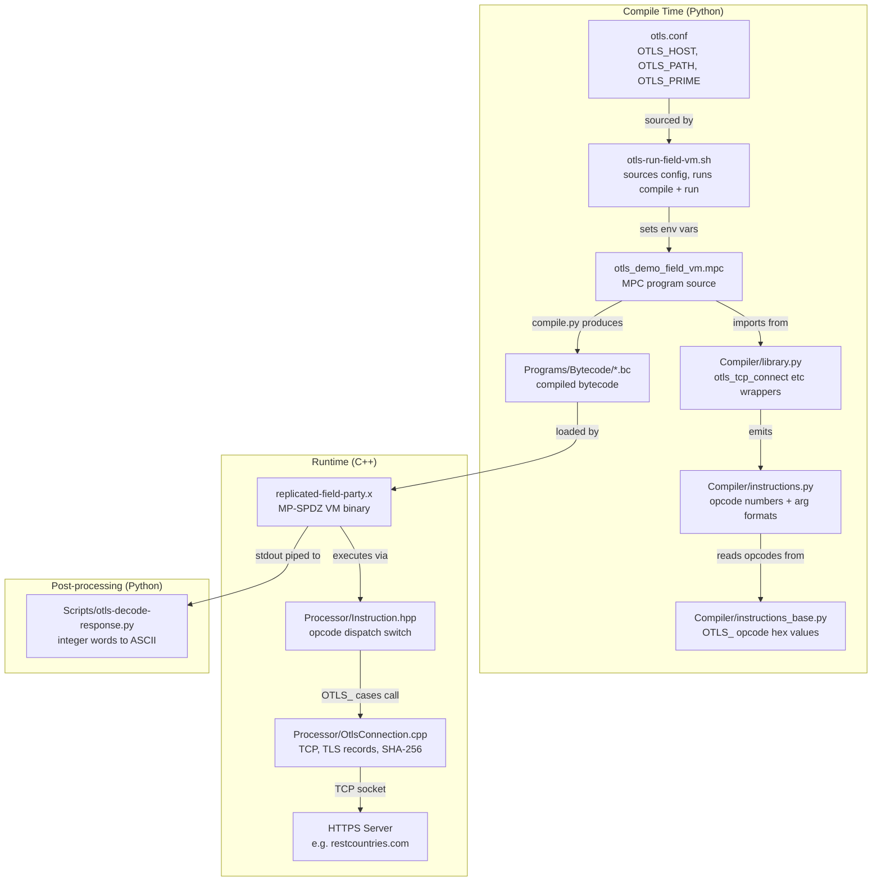
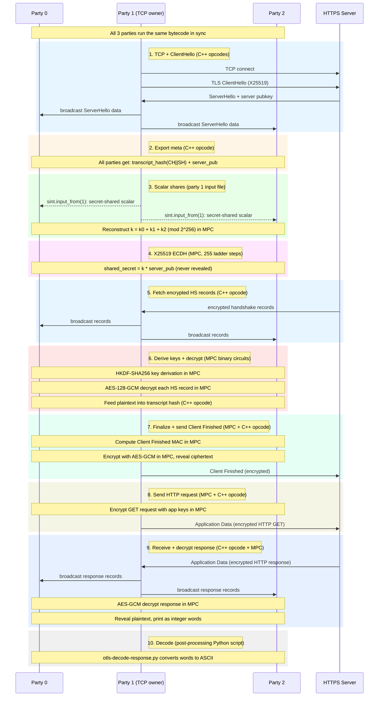

# OTLS: Oblivious TLS 1.3 in MP-SPDZ

OTLS performs a full TLS 1.3 handshake and HTTPS fetch inside the MP-SPDZ
MPC framework. Three parties jointly compute the handshake. Party 1 owns the
real TCP socket. The other parties see the same data through MP-SPDZ broadcast
channels. The TLS private key (X25519 scalar) is secret-shared across all
three parties and never revealed.

## How to run

Edit `otls.conf` to set the host and path you want to fetch:

```
OTLS_HOST=restcountries.com
OTLS_PATH="/v3.1/name/peru"
```

Then run:

```bash
cd MP-SPDZ
./Scripts/otls-run-field-vm.sh
```

This compiles the MPC program (about 18 minutes), builds the C++ binary,
runs 3 parties locally, and prints the decoded HTTP response.

You can also override the config with environment variables:

```bash
OTLS_HOST=restcountries.com OTLS_PATH="/v3.1/name/canada" ./Scripts/otls-run-field-vm.sh
```

If you only changed the request (host or path) and not the C++ code, you can
skip the C++ rebuild:

```bash
OTLS_SKIP_BUILD=1 ./Scripts/otls-run-field-vm.sh
```

## Configuration

All settings live in `otls.conf` at the root of the MP-SPDZ directory:

| Setting | What it is |
|---------|-----------|
| `OTLS_PRIME` | The field prime (2^255 - 19). Do not change this. |
| `OTLS_HOST` | The HTTPS host to connect to. |
| `OTLS_PATH` | The HTTP request path (e.g. `/v3.1/name/peru`). |

The prime is 2^255 - 19 because the X25519 ECDH computation runs inside MPC
and all the arithmetic happens in the Curve25519 field.

## Files

### MPC program

| File | What it does |
|------|-------------|
| `Programs/Source/otls_demo_field_vm.mpc` | The main program. Full TLS 1.3 handshake and HTTP fetch. Reads `OTLS_HOST` and `OTLS_PATH` from environment variables at compile time. |

### C++ (VM opcodes)

| File | What it does |
|------|-------------|
| `Processor/OtlsConnection.h` | Header for the OTLS C++ opcodes. |
| `Processor/OtlsConnection.cpp` | TCP connect, TLS record send/receive, ServerHello parsing, transcript hashing (SHA-256), and meta export. Party 1 does the real socket I/O and broadcasts to other parties. |
| `Processor/Instruction.hpp` | Where the OTLS opcodes are wired into the MP-SPDZ VM dispatch loop (look for the `OTLS_` cases). |

### Compiler (Python-side opcode wrappers)

| File | What it does |
|------|-------------|
| `Compiler/instructions.py` | Defines the OTLS VM instructions (opcode numbers, register formats). Search for `OTLS_` to find them. |
| `Compiler/library.py` | Python wrapper functions like `otls_tcp_connect()`, `otls_tcp_send_record_be()`, etc. Also has `otls_regint_bytes_be()` for packing byte strings into regint words. |

### Scripts

| File | What it does |
|------|-------------|
| `Scripts/otls-run-field-vm.sh` | Compile, build, and run. Sources `otls.conf` for settings. |
| `Scripts/otls-decode-response.py` | Decodes the integer output words into readable HTTP text. Called automatically by the run script. |

### Config

| File | What it does |
|------|-------------|
| `otls.conf` | Stores the prime, host, and path. Sourced by the run script. |

## Architecture diagrams

### File interactions (compile time vs runtime)



### Runtime sequence (TLS 1.3 handshake + HTTP fetch)



## How the pipeline works

1. Party 1 opens a TCP connection to the target HTTPS server.
2. Party 1 sends a TLS ClientHello and receives the ServerHello.
3. The server's X25519 public key and the transcript hash (SHA-256 of
   ClientHello + ServerHello) are broadcast to all parties.
4. Each party loads its share of the X25519 private scalar from an input file.
   The three shares are added (mod 2^256) in MPC to reconstruct the scalar
   in secret-shared form.
5. X25519 ECDH runs entirely in MPC (Montgomery ladder, 255 iterations).
   The shared secret is computed without revealing the private scalar.
6. TLS 1.3 key derivation (HKDF-SHA256) and AES-128-GCM decryption of the
   server's handshake records run in MPC using binary circuits.
7. The transcript hash is finalized and Client Finished is computed,
   encrypted, and sent over the TCP socket.
8. An encrypted HTTP request is sent.
9. The server's encrypted response records are received, decrypted in MPC,
   and the plaintext is revealed and printed as integer words.
10. The decoder script converts those words into readable HTTP text.
