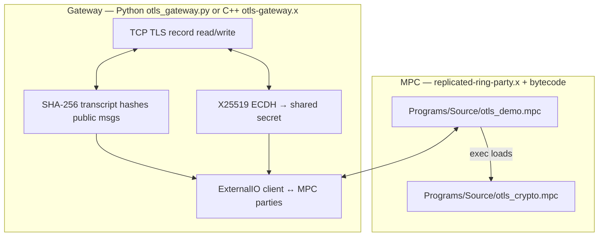

# OTLS in MP-SPDZ: files and TLS 1.3 flow

This document maps **which code lives where** to the **TLS 1.3 story** told step-by-step on [The Illustrated TLS 1.3 Connection](https://tls13.xargs.org/). That site is the best visual reference for *record order* and *handshake semantics*. Its numeric examples often use **TLS_AES_256_GCM_SHA384** (SHA-384); this project uses **TLS_AES_128_GCM_SHA256** (`0x1301`) and **SHA-256**, so intermediate hex values are checked against **[RFC 8448](https://www.rfc-editor.org/rfc/rfc8448)** Section 3 (same cipher suite), not byte-for-byte against the illustrated page’s SHA-384 trace.

## Architecture (one diagram)



**Security split:** the gateway sees plaintext wire bytes and computes **public** transcript hashes; **HKDF, HMAC-Finished, AES-GCM** run inside the `.mpc` program on secret-shared data so parties never reconstruct full keys/plaintext in one place (per your protocol settings).

## TLS 1.3 phases vs files (aligned with tls13.xargs.org sections)

| Illustrated TLS step (concept) | Who | Files / functions |
|--------------------------------|-----|-------------------|
| Client key exchange (X25519 keygen) | Gateway | OpenSSL in `ExternalIO/otls_gateway.cpp` / Python gateway |
| **ClientHello** record | Gateway | Encodes CH; hashes `CH\|\|SH` for MPC |
| **ServerHello** | Gateway | Parses SH, finishes ECDH |
| `early_secret` = HKDF-Extract(0,0) | MPC | `otls_crypto.mpc`: `hkdf_extract` |
| `derived` / `handshake_secret` | MPC | `derive_secret`, `hkdf_extract` |
| Transcript hash after SH | Gateway → MPC | Sent as `regint` words → `regint_words_to_bv` in `otls_demo.mpc` |
| **Traffic secrets** `c hs` / `s hs` | MPC | `derive_hs_keys_from_th_hash` in `otls_crypto.mpc` |
| **Decrypt** server handshake flights | MPC | `gcm_ctr` + `tls_nonce` per record index |
| Hash through server Finished | Gateway → MPC | `th_sf` words |
| **Client Finished** | MPC | `hmac_sha256(fin_key, th_sf)` + `build_tls_record` |
| **App keys** | MPC | `derive_app_keys_from_th_hash` |
| **HTTP request** record | MPC | `build_tls_record` (application data) |
| **Decrypt response** (sequence offset for NST) | MPC | `tls_nonce_r`, `gcm_ctr` |

## Function cheat sheet

### `Programs/Source/otls_crypto.mpc` (library)

- **Bit / hash / AEAD:** `bv_*`, `sha256`, `hmac_sha256`, `hkdf_*`, `derive_secret`, `aes128_encrypt_block`, `aes128_gcm_encrypt`, `gcm_ctr`
- **TLS naming:** `tls_nonce`, `tls_nonce_r`, `empty_hash`, `derive_hs_keys_from_th_hash`, `derive_app_keys_from_th_hash`, `build_tls_record`
- **Optional full-transcript helpers:** `tls_key_schedule`, `tls_app_keys` (hash raw `CH||SH` bytes inside MPC — not used when the gateway sends pre-hashed transcripts)

### `Programs/Source/otls_demo.mpc` (live ExternalIO)

- Imports the library via `exec`, re-exports crypto symbols
- **Only I/O glue:** `regint_words_to_bv`, `sint_chunks_to_bv`, `bv_reveal_to_sint_words`
- **Phases:** listen → read transcript + shared secret + HS records → decrypt HS → Finished + app encrypt → decrypt response → reveal

### `Programs/Source/otls_tls13_vectors.mpc`

- Recomputes **RFC 8448 Section 3** intermediate values (same suite as production) for regression / sanity checks

### `Programs/Source/otls_test_crypto.mpc` / `otls_aes_test.mpc`

- Small Bristol-circuit smoke tests (SHA-256, AES-128)

### Gateways

- `ExternalIO/otls_gateway.py`, `ExternalIO/otls_gateway.cpp` — record framing, ECDH, wire protocol to MPC (`ExternalIO/otls_protocol.md`)

## External API (HTTP 200) — next step

After vectors match RFC 8448 and an end-to-end run succeeds against a real server, pointing the gateway at an HTTPS API and checking **HTTP status 200** is a **gateway + parsing** check: the MPC side already exposes decrypted application plaintext to the gateway via `reveal_to_clients`.

## Quick compile

```bash
./compile.py -R 64 otls_demo
./compile.py -R 64 otls_tls13_vectors
```

Run vectors with your usual `replicated-ring-party.x` invocation and compare printed secrets to RFC 8448 Section 3.
